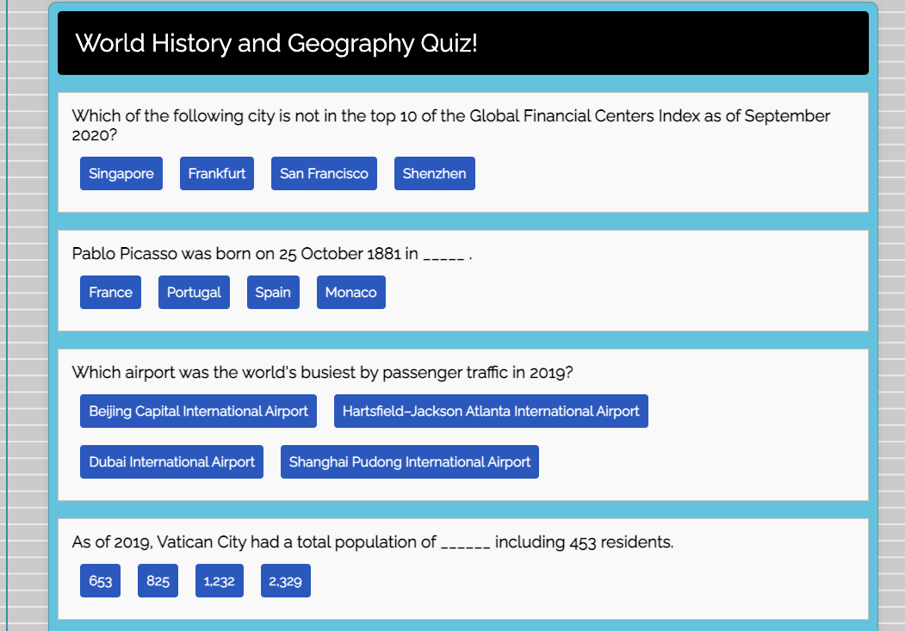
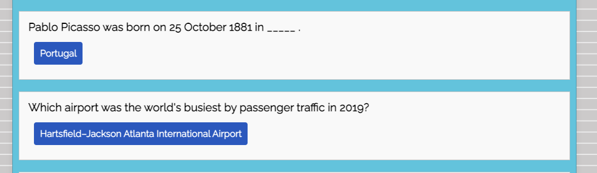
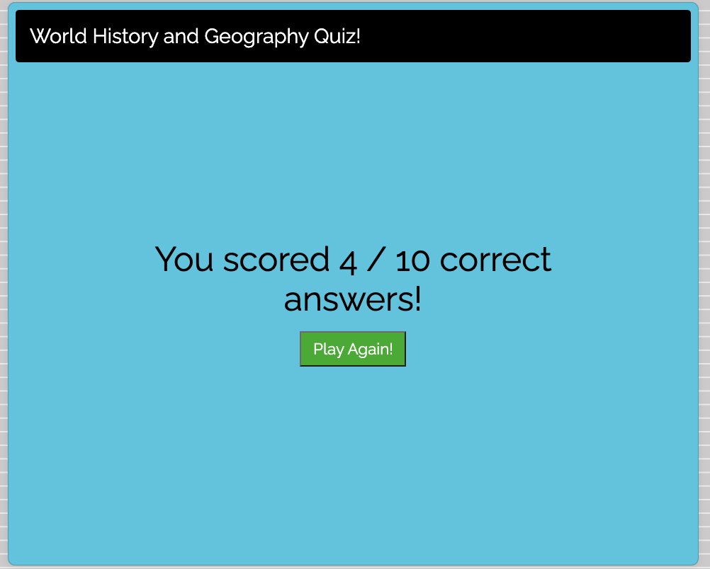

# React Quiz App 

## Table of Contents

- [Description](#description)
- [How to Install Dependencies](#how-to-install-dependencies)
- [Usage](#usage)
- [License](#license)
- [Contributoring](#contributing)
- [Tests](#tests)
- [Questions](#questions)

## Description

This is a simple quiz app built on the React framework. The app outputs 10 questions randomly every time the page loads. Upon answering all of them, the app will let the user know how many correct answers he/she has got.

Find the deployment: https://5fe15ada1c3c2a3240336f7f--gracious-keller-a1ea40.netlify.app/

## How to install dependencies

Please use npm install to get the dependencies and npm run to start the app. If run locally, add the following to the script in the package.json for smoother deployment. 

"start": "PORT=3001, react-scripts start",

## Usage

Screenshot 1: This is the main UI. There are 10 questions randomly displayed with 4 choices. 

---

Screenshot 2: Once the user makes a choice, the remaining options disappear.

---

Screenshot 3: Upon completing all questions, it would let the user know the result and offer the option of playing it again.

## License

MIT

## Contributing

Pull requests are welcome. For major changes, please open an issue first to discuss what you would like to change. Also, please make sure to update tests as appropriate.

## Questions

[Email Me!](mailto:nishii.dev.syd@gmail.com)

[Link to my GitHub](https://github.com/noriyuki-ishii-820)
